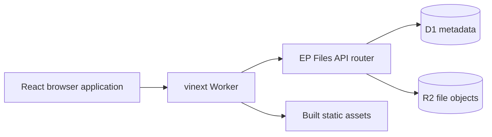

# EP Files

EP Files is a personal file workspace for uploading, organizing, previewing, sharing, and managing files in the browser.

**Live application:** [ep-files-app.markk877.chatgpt.site](https://ep-files-app.markk877.chatgpt.site)

[](./LICENSE)

> The current production application lives in `frontend/` and runs as a Cloudflare-compatible Worker with D1 and R2. The Django code at the repository root is retained as a legacy university implementation and is not used by the live deployment.

## Features

- Account registration and secure cookie-based sessions
- File uploads up to 100 MB with real transfer and server-processing states
- Nested folders, drag and drop, renaming, moving, and ZIP folder downloads
- Image, video, audio, PDF, text, and modern Office file previews
- HTTP range requests for efficient video and audio playback
- Versioned, authenticated image-preview caching
- Favorites, recent activity, storage usage, and full-text name search
- Trash with restore, permanent deletion, and recursive folder handling
- Public file and folder links with optional expiration
- User-to-user read and read/write permissions with folder inheritance
- In-browser editing for supported text files
- File reports and an administrator dashboard
- Responsive light and dark themes

## Technology

| Area | Technology |
| --- | --- |
| UI | React 19, React Router, Material UI, Emotion |
| Application runtime | vinext, Next.js 16 application shell, Cloudflare Workers |
| Metadata and sessions | Cloudflare D1 / local Miniflare SQLite |
| File storage | Cloudflare R2 / local Miniflare R2 |
| Validation | React Hook Form, Yup |
| Archive generation | fflate |
| Build tooling | Vite 8, ESLint, Wrangler |
| Hosting | OpenAI Sites on Cloudflare infrastructure |

## Quick Start

### Requirements

- Node.js 20 or newer
- npm 10 or newer

### Run the current application locally

```bash
git clone https://github.com/escobar877-ic/ep-files.git
cd ep-files/frontend
npm ci
npm run sites:dev -- --port 5173
```

Open [http://localhost:5173](http://localhost:5173).

The Sites development command starts the UI, Worker API, local D1 database, and local R2-compatible storage together. No Django server is required for this mode.

On a new empty database, the first registered account receives administrator privileges. This behavior is intended for initial setup only.

## Available Commands

Run these commands from `frontend/`:

| Command | Purpose |
| --- | --- |
| `npm run sites:dev -- --port 5173` | Run the complete app with local D1 and R2 bindings |
| `npm run sites:build` | Create the production Sites build |
| `npm run lint` | Run ESLint with zero warnings allowed |
| `npm run dev` | Run the legacy SPA development mode that expects a Django API on port 8000 |
| `npm run build` | Build the legacy standalone SPA |
| `npm run preview` | Preview the standalone SPA build |

## Configuration

The primary application uses logical bindings declared in [`frontend/.openai/hosting.json`](./frontend/.openai/hosting.json):

```json
{
  "d1": "DB",
  "r2": "FILES"
}
```

- `DB` stores users, sessions, file metadata, folders, permissions, favorites, history, and reports.
- `FILES` stores uploaded files and avatars.
- Local bindings are configured in `frontend/vite.config.js` and persisted by Miniflare under `frontend/.wrangler/`.
- Hosted resource creation and binding are managed by Sites.

Do not commit runtime secrets or production credentials. The application does not require a client-side API secret.

## Default Limits

| Limit | Value |
| --- | --- |
| File size | 100 MB per file |
| Initial user storage | 100 MB |
| Maximum administrator-assigned storage | 2 GB per user |
| Avatar size | 2 MB |
| Editable text file size | 2 MB |
| Session lifetime | 7 days |

Potentially executable file extensions such as `.exe`, `.bat`, `.cmd`, `.jar`, `.msi`, `.sh`, and `.ps1` are rejected by the Worker API.

## Architecture



The Worker handles both the application shell and `/api/*`. Authentication is stored in a hashed server-side session record; the browser receives only a `Secure`, `HttpOnly`, `SameSite=Lax` cookie.

See [Architecture](./docs/ARCHITECTURE.md) for request flows, storage design, permissions, and caching behavior.

## API Example

The API is served from `/api/`. Authenticated examples should preserve the session cookie:

```bash
curl -c cookies.txt \
  -H 'Content-Type: application/json' \
  -d '{"name":"Demo User","email":"demo@example.com","password":"secret123"}' \
  http://localhost:5173/api/auth/register/

curl -b cookies.txt http://localhost:5173/api/files/
```

See the complete [API Reference](./docs/API.md).

## Repository Layout

```text
frontend/
  app/                 vinext/Next application shell
  src/                 React UI and client-side application logic
  worker/              Worker API and request entry point
  drizzle/             D1 schema migration
  public/              Fonts, images, icons, and attribution notices
  .openai/              Sites hosting metadata
docs/                  Current English technical documentation
ep_files_app/, main/   Legacy Django implementation
tests/                 Legacy Django test suite
```

## Verification

Before submitting a change to the current application:

```bash
cd frontend
npm run lint
npm run sites:build
```

The legacy Django suite can be run separately with `pytest` when modifying the root Python implementation.

## Documentation

- [Documentation index](./docs/README.md)
- [Architecture](./docs/ARCHITECTURE.md)
- [API reference](./docs/API.md)
- [Deployment](./docs/DEPLOYMENT.md)
- [Frontend development](./frontend/README.md)
- [Contributing](./CONTRIBUTING.md)
- [Security policy](./SECURITY.md)
- [Asset attributions](./frontend/public/assets/ATTRIBUTIONS.md)

## License

EP Files is available under the [MIT License](./LICENSE). Third-party fonts and visual assets retain their original licenses; see the attribution files in `frontend/public/`.
