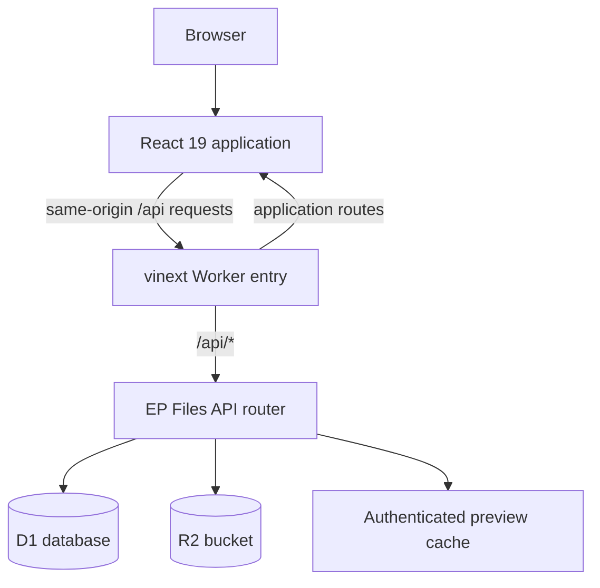
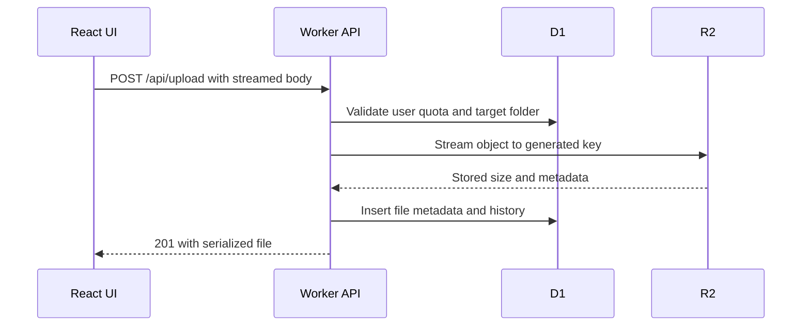

# EP Files Architecture

## Overview

The current EP Files deployment is a single Cloudflare-compatible Worker application. It serves the vinext application shell, static assets, and the complete `/api/*` backend from one origin.

## Runtime Layers

### Application shell

`frontend/app/` provides the vinext/Next-compatible shell. `SiteApp.jsx` loads the browser application without server-side rendering because the product relies on browser routing, dialogs, uploads, drag and drop, and session-aware client state.

### React application

`frontend/src/` contains:

- route definitions and protected-route guards;
- the file manager, account area, trash, public access, and admin pages;
- upload and background-task state;
- file preview rendering;
- Material UI themes and shared navigation components;
- the Axios same-origin API client.

React Router owns product navigation after the application shell has loaded.

### Worker API

`frontend/worker/index.js` sends `/api/*` requests to `handleApiRequest` and delegates all other requests to vinext. `frontend/worker/api.js` contains the API router and domain operations.

The Worker uses Web Platform APIs and Cloudflare bindings, so no standalone Node or Django process is needed in production.

## Persistence

### D1 binding: `DB`

D1 stores structured state:

| Table | Purpose |
| --- | --- |
| `users` | Account, role, active state, avatar reference, and storage quota |
| `sessions` | Hashed session tokens and expiration timestamps |
| `folders` | Folder hierarchy, ownership, trash state, and public-link metadata |
| `files` | Object key, size, type, ownership, folder, trash state, and public link |
| `favorites` | Per-user file and folder favorites |
| `permissions` | Direct file or folder grants and folder inheritance |
| `file_history` | Upload, download, move, rename, edit, and deletion events |
| `file_reports` | User reports and administrator resolution state |

The hosted schema is defined in `frontend/drizzle/0000_ep_files.sql`. The Worker also initializes an empty local database defensively during development.

### R2 binding: `FILES`

R2 stores binary data:

- uploaded files under `files/<user-id>/<uuid>`;
- avatars under `avatars/<user-id>/<uuid>`.

Object keys are generated by the server and never derived from a user-provided path. File names remain metadata in D1.

## Authentication

1. Registration or login creates a cryptographically random token.
2. Only the SHA-256 hash of that token is stored in D1.
3. The raw token is sent in the `ep_session` cookie.
4. The cookie is `Secure`, `HttpOnly`, `SameSite=Lax`, scoped to `/`, and valid for seven days.
5. Each authenticated request hashes the cookie value and resolves the active user from D1.

Blocking a user deletes their sessions. Logging out deletes the current session. Account deletion removes the user's R2 objects before deleting the D1 account.

The first user created in a completely empty database is marked as staff and superuser so the deployment can be administered.

## Authorization

Ownership always implies full access. Shared access uses two grant types:

- `read` permits listing, previewing, and downloading;
- `read_write` also permits supported mutations.

Folder grants can inherit into descendants. File grants are direct. Write access to an individual file is limited to supported editable text formats; folder write access also permits uploads and moves into that folder.

Only owners can delete resources, create or disable public links, and manage grants. Administrator endpoints additionally require `is_staff` or `is_superuser`.

## Upload Flow

The client reports transfer progress from the browser upload event. Reaching 100 percent means the request body has left the browser; the UI then shows a separate server-processing phase until R2 and D1 complete.

Uploads are rejected when they exceed the per-file limit, exceed the user's remaining quota, use a blocked extension, or target a folder without write access.

## Download and Preview Flow

- Downloads stream the R2 object with `Content-Disposition: attachment`.
- Previews use `Content-Disposition: inline`.
- Range headers are forwarded to R2 and returned as `206 Partial Content`, enabling efficient video and audio seeking.
- Image preview URLs include the file update timestamp as a version.
- Authorized full preview responses use a long-lived private browser cache.
- The Worker cache may store a preview body, but authorization is checked before every cache lookup.

The cache key uses the generated storage key and file version rather than a public file name.

## Search

The file manager downloads the user's accessible file and folder metadata once and filters names in the browser. Typing in the search field does not issue a request for every character. `/api/search` remains available as a batched server-side fallback.

## Trash and Deletion

Normal deletion marks D1 rows with `is_deleted` and `deleted_at`; the R2 object remains available for restoration. Folder deletion marks the full descendant tree and its files in one recursive operation.

Permanent deletion removes both metadata and R2 objects. Clearing trash removes every deleted object owned by the current user.

## Public Links

Owners can enable a random public token for a file or folder. Links may be permanent or expire after 1 to 525,600 minutes. Expired links are invalidated when accessed.

Public folder links expose only the selected folder's immediate files and child-folder metadata. Public file reports are stored for administrator review.

## Legacy Django Implementation

The repository still contains `main/`, `ep_files_app/`, root Python requirements, Docker files, and pytest tests. That system can be useful for historical coursework and pattern documentation, but it is not part of the current Sites deployment. Avoid mixing its environment variables or storage assumptions into the Worker application.
